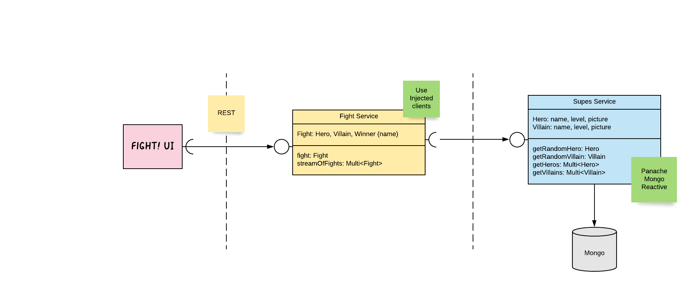

# Quarkus gRPC Demo - a.k.a "The Supes Demo!"

This repository demonstrates how to use Quarkus and gRPC.



## Structure

* `supes-api`: defines the _gRPC_ services (`proto` files) and handle the generation
* `supes-service`: implements and exposes the `supes-service`. The gRPC server is started on the port 9001.
* `fight-service`: consumes the `supes-service`, serves the UI. The gRPC server is started on port 9000.
* `infrastructure`:  contains the mongo initialization script

## Build

```bash
mvn clean install
```

## Run

You need 3 terminals.

In the first one, start Mongo by running, from the root directory:

```bash
docker-compose up
```

The Mongo instance get initialized with a bunch of _supes_.

In the second terminal, start the `supes-service` by running:

```bash
java -jar supes-service/target/supes-service-1.0-SNAPSHOT-runner.jar
``` 

In the third terminal, run the `fight-service` by running:

```bash
java -jar fight-service/target/fight-service-1.0-SNAPSHOT-runner.jar
```

Then, in a browser, open: http://localhost:8080/ and start the **fights!** 